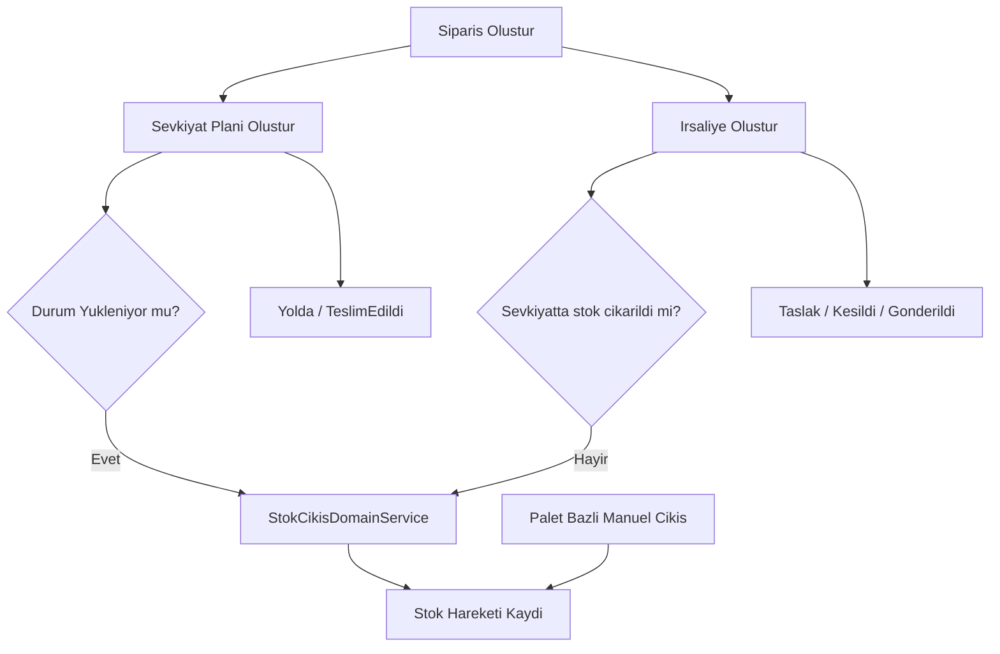

# Cikis Akisi Raporu

Bu rapor, `Sipariş -> Süreçler -> Çıkış` akışını mevcut backend implementasyonuna göre analiz eder. Amaç, mevcut akışın gerçek davranışını koddan çıkarmak, endüstri standardı açısından riskleri işaretlemek ve uygulanabilir bir geliştirme planı oluşturmaktır.

## Kapsam

İncelenen ana modüller:

- `BackendProje/app/api/v1/routers/siparisler.py`
- `BackendProje/app/api/v1/routers/sevkiyat_planlama.py`
- `BackendProje/app/api/v1/routers/irsaliyeler.py`
- `BackendProje/app/api/v1/routers/stok_islemleri.py`
- `BackendProje/app/application/use_cases/siparis_use_cases.py`
- `BackendProje/app/application/use_cases/sevkiyat_plani_use_cases.py`
- `BackendProje/app/application/use_cases/irsaliye_use_cases.py`
- `BackendProje/app/core/services/stok_cikis_domain_service.py`
- `BackendProje/app/core/services/palet_cikis_service.py`
- `BackendProje/app/application/dto/sevkiyat_plani_dto.py`
- `BackendProje/app/application/dto/irsaliye_dto.py`
- `BackendProje/models.py`

## Mevcut Akis

Koddan izlenen mevcut çıkış akışı şu şekilde çalışıyor:

1. Sipariş, `/api/siparisler` üzerinden oluşturuluyor.
   Kanıt: `BackendProje/app/api/v1/routers/siparisler.py:67-85`, `BackendProje/app/application/use_cases/siparis_use_cases.py:94-133`

2. Siparişe bağlı tek bir sevkiyat planı oluşturulabiliyor.
   Kanıt: `BackendProje/models.py:364-365`, `BackendProje/models.py:395-415`, `BackendProje/app/application/use_cases/sevkiyat_plani_use_cases.py:91-124`

3. İrsaliye, siparişe bağlı olarak ayrıca oluşturuluyor; sipariş için birden fazla irsaliye oluşturulmasına model izin veriyor.
   Kanıt: `BackendProje/models.py:367`, `BackendProje/models.py:422-440`, `BackendProje/app/application/use_cases/irsaliye_use_cases.py:105-150`

4. Stok çıkışı iki farklı yoldan tetiklenebiliyor:
   - Sevkiyat planı durumu `Yukleniyor` olduğunda otomatik ürün bazlı FIFO stok düşümü
   - İrsaliye oluşturulurken, sevkiyat stok çıkışı yapılmamış görünüyorsa otomatik ürün bazlı FIFO stok düşümü
   Kanıt: `BackendProje/app/application/use_cases/sevkiyat_plani_use_cases.py:184-220`, `BackendProje/app/application/use_cases/irsaliye_use_cases.py:139-158`

5. Operasyon tarafında ayrıca palet bazlı manuel çıkış akışı da var. Bu akış depo erişimi, staging kontrolü ve palet/lot izini koruyor.
   Kanıt: `BackendProje/app/api/v1/routers/stok_islemleri.py:84-212`, `BackendProje/app/core/services/palet_cikis_service.py:42-210`

6. Sipariş, sevkiyat ve irsaliye durum makineleri birbirinden bağımsız ilerliyor; aralarında merkezi bir orkestrasyon yok.
   Kanıt: `BackendProje/app/application/use_cases/siparis_use_cases.py:169-218`, `BackendProje/app/application/use_cases/sevkiyat_plani_use_cases.py:155-225`, `BackendProje/app/application/use_cases/irsaliye_use_cases.py:183-220`

## Ozet Diyagram

## Endustri Standardina Gore Beklenen Akis

Tipik bir WMS/TMS çıkış akışında şu adımlar ayrışır:

1. Sipariş onayı
2. Tahsis / rezervasyon
3. Toplama / palet seçimi
4. Staging doğrulaması
5. Yükleme onayı
6. Stok düşümü
7. İrsaliye / sevk evrakı üretimi
8. Taşıyıcı teslimi ve teslimat doğrulaması

Mevcut yapıda bu adımların önemli bir kısmı ya yok, ya tek bir durum değişimine sıkıştırılmış, ya da paralel akışlar arasında tutarsız bırakılmış durumda.

## Bulgular

### Kritik 1: Aynı sipariş için tekrar irsaliye oluşturmak stoktan tekrar düşebiliyor

Kanıt:

- Sipariş ile irsaliye ilişkisi bire-çok tanımlı; model aynı sipariş için birden fazla irsaliyeye izin veriyor: `BackendProje/models.py:367`, `BackendProje/models.py:426-427`
- İrsaliye oluşturma akışı, daha önce irsaliye kesilip kesilmediğini veya stok hareketinin daha önce yazılıp yazılmadığını kontrol etmiyor; yalnızca sevkiyat planı durumu üzerinden karar veriyor: `BackendProje/app/application/use_cases/irsaliye_use_cases.py:139-158`

Etkisi:

- Aynı sipariş için ikinci kez irsaliye oluşturulursa, sevkiyat planı henüz `Yukleniyor` seviyesine gelmediyse stok ikinci kez düşebilir.
- Bu, envanter eksiye düşmese bile fiili stok ile sistem stokunu ayırır ve sevkiyat doğruluğunu bozar.

Yorum:

- Bu akış idempotent değil.
- Çıkış tetikleme kriteri "stok zaten çıktı mı?" yerine "sevkiyat planı şu durumda mı?" olarak kurulmuş.

### Kritik 2: Sevkiyat planı ilk anda `Yukleniyor` veya daha ileri durumda açılırsa stok hiç düşmeyebiliyor

Kanıt:

- DTO, sevkiyat planı oluştururken `Planlandi`, `Yukleniyor`, `Yolda`, `TeslimEdildi` değerlerinin tamamını kabul ediyor: `BackendProje/app/application/dto/sevkiyat_plani_dto.py:30-50`, `BackendProje/tests/unit/dto/test_dto_sinir_degerleri.py:300-304`
- Oluşturma use case'i gelen durumu doğrudan kaydediyor: `BackendProje/app/application/use_cases/sevkiyat_plani_use_cases.py:100-113`
- Stok çıkışı ise yalnızca güncelleme sırasında `Planlandi -> Yukleniyor` geçişinde tetikleniyor: `BackendProje/app/application/use_cases/sevkiyat_plani_use_cases.py:184-220`

Etkisi:

- Operasyon veya entegrasyon sevkiyat planını doğrudan `Yukleniyor` ya da `Yolda` açarsa, stok çıkışı atlanabilir.
- Sistem sevkiyat ilerlemiş gibi görünürken stok hâlâ depoda görünür.

### Yuksek 1: Sipariş bazlı otomatik stok çıkışı, palet bazlı güvenlik kontrollerini ve izlenebilirliği atlıyor

Kanıt:

- `StokCikisDomainService`, çıkışı sadece `urun_id + miktar` üzerinden yapıyor ve stok hareketini palet/lot kırılımı olmadan yazıyor: `BackendProje/app/core/services/stok_cikis_domain_service.py:35-98`
- `StokHareketi` entity'sinde `lot_id`, `palet_id`, `irsaliye_no`, `raf_id` gibi alanlar var ama bu servis bunları doldurmuyor: `BackendProje/app/core/entities/stok_hareketi.py:16-33`
- FIFO palet sorgusu aktif lot/palet filtresi yapıyor ama staging veya depo erişim doğrulaması yapmıyor: `BackendProje/app/infrastructure/persistence/repositories/sa_palet_repository.py:99-124`
- Buna karşılık manuel palet çıkışı akışı staging kontrolü, depo erişim kontrolü ve palet/lot bazlı hareket kaydı yapıyor: `BackendProje/app/core/services/palet_cikis_service.py:58-103`, `BackendProje/app/core/services/palet_cikis_service.py:163-210`

Etkisi:

- Hangi lotların ve hangi paletlerin sevk edildiği sistemsel olarak net izlenemiyor.
- Staging raftaki veya yanlış depodaki stokların otomatik sipariş çıkışına dahil olması teknik olarak engellenmiyor.
- Geri çağırma, kalite takibi ve müşteri şikayeti analizi zorlaşır.

### Yuksek 2: Sipariş, sevkiyat ve irsaliye durumları birbirine senkron değil

Kanıt:

- Sipariş durumu yalnızca `SiparisGuncelleUseCase` içinde manuel değişiyor: `BackendProje/app/application/use_cases/siparis_use_cases.py:169-218`
- Sevkiyat güncellendiğinde sipariş durumu ilerletilmiyor: `BackendProje/app/application/use_cases/sevkiyat_plani_use_cases.py:155-225`
- İrsaliye oluşturulup gönderildiğinde de sipariş durumu güncellenmiyor: `BackendProje/app/application/use_cases/irsaliye_use_cases.py:105-220`

Etkisi:

- Sipariş `Bekleme` durumunda görünürken sevkiyat `TeslimEdildi` olabilir.
- KPI, SLA, müşteri ekranları ve raporlar tutarsızlaşır.

### Yuksek 3: Zorunlu operasyon alanları API sınırında zorunlu değil; hata veritabanına kadar gidiyor

Kanıt:

- `SevkiyatPlani.yukleme_tarihi` ve `Irsaliye.irsaliye_tarihi` veritabanında zorunlu: `BackendProje/models.py:404`, `BackendProje/models.py:429`
- Buna rağmen request DTO'larda ikisi de opsiyonel tanımlı: `BackendProje/app/application/dto/sevkiyat_plani_dto.py:38`, `BackendProje/app/application/dto/irsaliye_dto.py:37`
- Hatta DTO testi `yukleme_tarihi=None` durumunu geçerli kabul ediyor: `BackendProje/tests/unit/dto/test_dto_sinir_degerleri.py:306-311`
- Beklenmeyen exception'lar global handler tarafından 500'e çevriliyor: `BackendProje/core/exception_handlers.py:31-45`

Etkisi:

- Kullanıcı hatası 422/400 yerine 500 olarak dönebilir.
- İş akışı validasyonu API katmanında değil, veritabanı katmanında patlıyor.

### Yuksek 4: İrsaliyedeki `sevkiyat_id` için varlık ve sipariş uyumu doğrulanmıyor

Kanıt:

- DTO `sevkiyat_id` alıyor: `BackendProje/app/application/dto/irsaliye_dto.py:35-40`
- Use case yalnızca siparişin varlığını kontrol ediyor; `sevkiyat_id` doğrulaması yapmadan entity'ye kopyalıyor: `BackendProje/app/application/use_cases/irsaliye_use_cases.py:110-124`
- Modelde `siparis_id` ve `sevkiyat_id` ayrı foreign key'ler; ama "aynı siparişe ait olmalı" kuralı veritabanında da yok: `BackendProje/models.py:426-427`

Etkisi:

- Farklı siparişe ait sevkiyat planı yanlış irsaliyeye bağlanabilir.
- Evrak ve operasyon zinciri bozulur.

### Yuksek 5: Nihai hale gelmiş kayıtlar hâlâ düzenlenebilir

Kanıt:

- Sevkiyat planı güncelleme akışı, teslim edilmiş sevkiyatta bile plaka, şoför, kapı gibi alanları değiştirebilir; buna engel yok: `BackendProje/app/application/use_cases/sevkiyat_plani_use_cases.py:167-182`
- İrsaliye güncelleme akışı, durum ne olursa olsun `belge_turu`, `tir_plaka`, `sofor_adi` alanlarını değiştiriyor: `BackendProje/app/application/use_cases/irsaliye_use_cases.py:195-200`
- Domain entity'de `duzenlenebilir_mi()` kuralı olmasına rağmen use case bunu hiç kullanmıyor: `BackendProje/app/core/entities/irsaliye.py:45-47`
- Sipariş güncelleme akışı da sevk edilmiş ya da teslim edilmiş siparişte müşteri/adres/teslimat tarihi değişikliğini engellemiyor: `BackendProje/app/application/use_cases/siparis_use_cases.py:188-200`

Etkisi:

- Hukuki evrak, audit trail ve operasyon geçmişi güvenilirliğini kaybeder.
- Geriye dönük kayıt düzeltmeleri gerçek akışla karışır.

### Orta 1: Admin-only silme kuralı, genel güncelleme üzerinden dolanılabiliyor

Kanıt:

- Silme endpoint'i sadece `admin` rolüne açık: `BackendProje/app/api/v1/routers/siparisler.py:88-96`
- Ama genel güncelleme endpoint'i `lojistik` rolüne de açık: `BackendProje/app/api/v1/routers/siparisler.py:77-85`
- DTO `aktif` alanını kabul ediyor ve use case bunu doğrudan uyguluyor: `BackendProje/app/application/use_cases/siparis_use_cases.py:197-198`

Etkisi:

- `lojistik` kullanıcısı `PUT /api/siparisler/{id}` ile siparişi pasife alabilir.
- Yetki tasarımı ile gerçek davranış çelişiyor.

### Orta 2: Numara üretimi ve benzersizlik kontrolleri yarış koşuluna açık

Kanıt:

- Sipariş numarası son kaydı okuyup bir arttırılarak üretiliyor: `BackendProje/app/infrastructure/persistence/repositories/sa_siparis_repository.py:99-115`
- İrsaliye numarası da aynı şekilde üretiliyor: `BackendProje/app/infrastructure/persistence/repositories/sa_irsaliye_repository.py:76-92`
- Oluşturma use case'lerinde bu yarış için retry ya da 409 dönüş mantığı yok: `BackendProje/app/application/use_cases/siparis_use_cases.py:99-118`, `BackendProje/app/application/use_cases/irsaliye_use_cases.py:114-127`

Etkisi:

- Eşzamanlı isteklerde unique constraint ihlali yaşanabilir.
- Kullanıcı anlamlı bir 409 yerine 500 alabilir.

### Orta 3: Depocu fiziksel çıkışı yapabiliyor ama sipariş/sevkiyat akışını ilerletemiyor

Kanıt:

- Sipariş ve sevkiyat router'ları `depocu` rolünü dışlıyor: `BackendProje/app/api/v1/routers/siparisler.py:44-85`, `BackendProje/app/api/v1/routers/sevkiyat_planlama.py:37-82`
- Buna karşılık palet bazlı çıkış endpoint'leri `depocu` rolüne açık: `BackendProje/app/api/v1/routers/stok_islemleri.py:84-212`

Etkisi:

- Fiziksel çıkış ile yönetsel çıkış akışı iki ayrı yoldan ilerler.
- Depoda fiilen sevk edilen mal ile sipariş/sevkiyat statüsü arasında fark oluşabilir.

## Surec Eksikleri

Kod bazında görünen başlıca süreç eksikleri:

- Tahsis / rezervasyon adımı yok
- Toplama / pick confirmation adımı yok
- Yükleme onayı ile stok düşümü tek olayda birleşmiş
- Sipariş kalemi bazlı sevkiyat gerçekleşme kaydı yok
- Parsiyel sevkiyat / kısmi teslimat modeli yok
- Çıkış ters kaydı / geri alma / düzeltme akışı belirgin değil
- İrsaliye bazlı idempotency mekanizması yok
- Sipariş-sevkiyat-irsaliye arasında merkezi orchestration ya da saga yok

## Onceliklendirilmis Sonuc

En riskli üç konu:

1. Aynı siparişte mükerrer irsaliye ile mükerrer stok düşümü
2. Sevkiyat planının ileri durumda açılması halinde stok düşümünün atlanması
3. Otomatik sipariş bazlı çıkışta palet/lot izlenebilirliğinin ve staging/depo kontrollerinin kaybedilmesi

Bu üç konu çözülmeden çıkış akışı operasyonel olarak güvenilir sayılmaz.

## Uygulama Plani

### Faz 1: Akışı güvenli hale getir

- `SevkiyatPlaniOlusturRequestDTO` içinde başlangıç durumunu zorunlu olarak `Planlandi` yap; `Yukleniyor` ve sonrası yalnızca özel ilerletme komutu ile verilsin.
- `IrsaliyeOlusturUseCase` içinde stok çıkışını, sevkiyat/irsaliye geçmişi yerine açık bir "çıkış işlendi" kaydı üzerinden idempotent hale getir.
- Sipariş bazlı stok düşümünü doğrudan ürün bazlı çalıştırmak yerine palet tahsisli bir çıkış servisine taşı.
- `IrsaliyeOlusturUseCase` içinde `sevkiyat_id` varsa planın varlığını ve aynı siparişe ait olduğunu doğrula.

### Faz 2: Süreç adımlarını ayrıştır

- Yeni bir `SevkiyatYurut` ya da `YuklemeOnayla` use case'i ekle; stok çıkışı yalnızca burada çalışsın.
- Sipariş kalemi bazlı tahsis/toplama kaydı için yeni bir tablo veya aggregate tasarla.
- Parsiyel sevkiyat desteklenecekse sipariş kalemi karşılığında "sevk edilen miktar" alanı veya ayrı sevkiyat kalemi modeli ekle.
- İrsaliyeyi, sevkiyattan türetilen evrak olarak konumlandır; aynı sevkiyata bağlı mükerrer belge kurallarını netleştir.

### Faz 3: Durum senkronizasyonu kur

- Sipariş, sevkiyat ve irsaliye durumlarını tek bir durum haritasına bağla.
- Örnek kural seti:
  - Sevkiyat planı oluşturuldu -> sipariş `Hazirlaniyor`
  - Yükleme onaylandı -> sipariş `YolaCikti`
  - Teslim edildi -> sipariş `TeslimEdildi`
- Bu geçişleri servis/use case içinde merkezi bir orchestration katmanında yönet.

### Faz 4: Veri doğrulama ve yetki sıkılaştırma

- `yukleme_tarihi` ve `irsaliye_tarihi` alanlarını API seviyesinde zorunlu yap.
- Saat alanlarına regex veya `time` tipli doğrulama ekle.
- `aktif` alanını genel sipariş güncelleme DTO'sundan çıkar; pasife alma için ayrı yetkili komut bırak.
- Teslim edilmiş sevkiyat, gönderilmiş irsaliye ve yola çıkmış sipariş üzerinde hangi alanların değiştirilebileceğini kısıtla.

### Faz 5: İzlenebilirlik ve test

- Stok çıkış hareketine gerçek `lot_id`, `palet_id`, `raf_id`, `irsaliye_no` değerlerini yaz.
- Şu test senaryolarını ekle:
  - Aynı sipariş için ikinci irsaliye oluşturma
  - Planı doğrudan `Yukleniyor` açma
  - Yanlış `sevkiyat_id` ile irsaliye oluşturma
  - Teslim edilmiş sevkiyatın güncellenmeye çalışılması
  - `aktif=false` ile lojistik kullanıcısının siparişi pasife almaya çalışması
  - Eşzamanlı sipariş ve irsaliye numarası üretimi

## Kapanis

Mevcut tasarımda çıkış akışı çalışıyor, ancak iş kuralları kritik noktalarda dağılmış ve bazıları birbirini boşa düşürüyor. Kısa vadede idempotency ve durum geçişleri düzeltilmeli; orta vadede ise siparişten fiziksel sevke giden akış, palet tahsisli ve tek komuttan yürüyen bir orchestration modeline taşınmalı.
